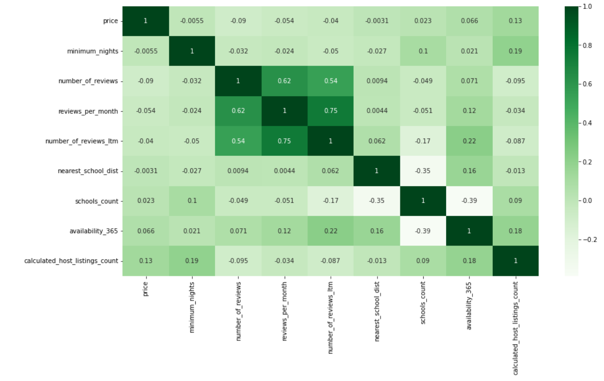
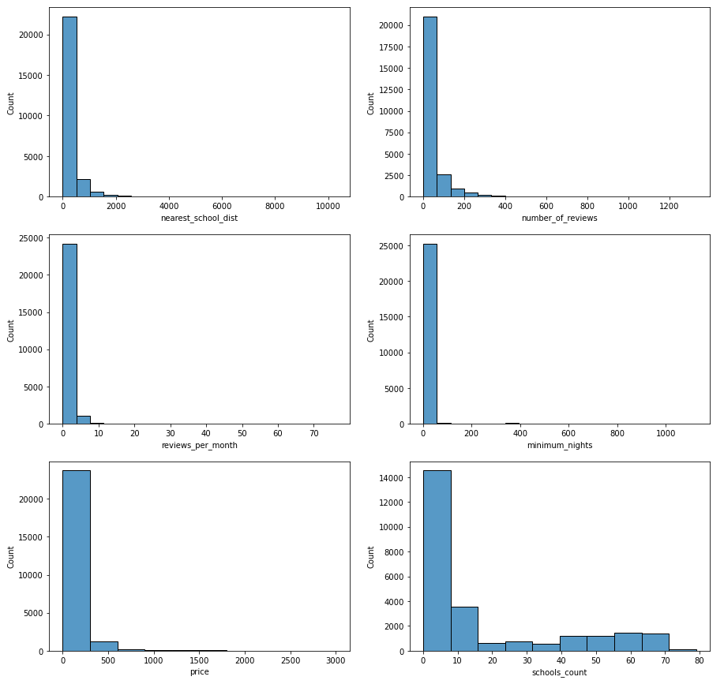
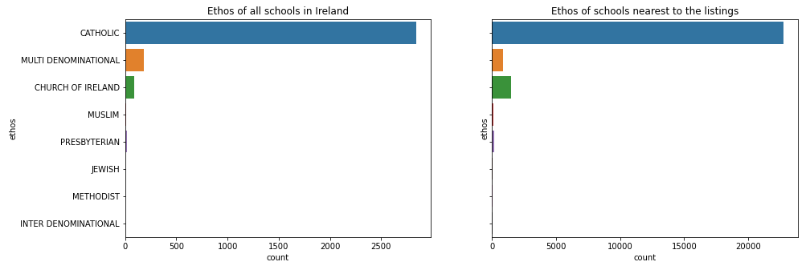
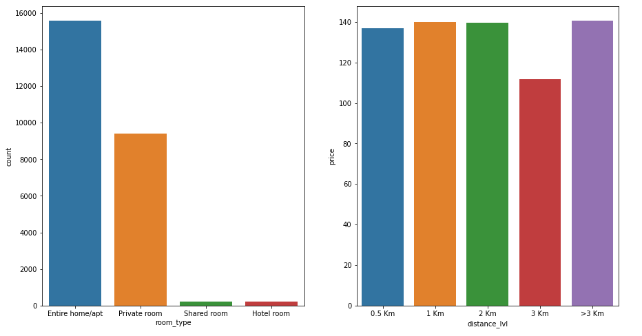
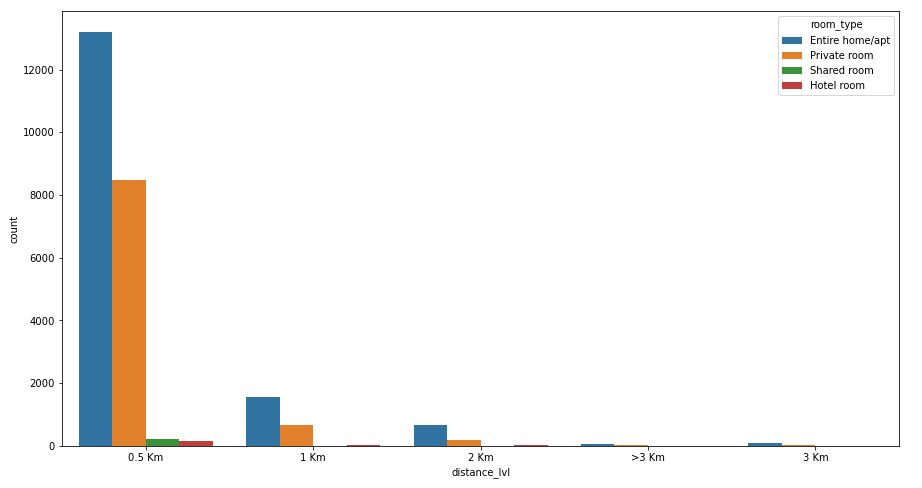
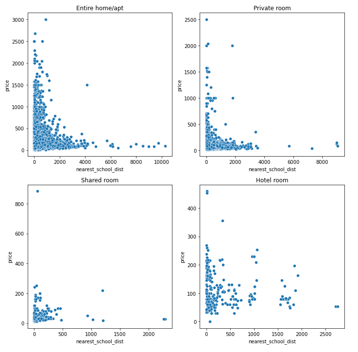

# DIA-Project-First-Semester-NCI
Project Source code for DIA Module - 1st Semester - MSc in Data Analytics - National College of Ireland

## Abstract
The main goal of this project is to use Hadoop 
Map-Reduce as a part of the whole process to investigate the 
influence of public amenities such as schools on predictive 
analysis of the prices of Airbnb rentals in the area. The project 
will employ a customized version of KDD to undertake 
systematic data evaluation. This will make the entire process of 
cleaning, converting, and analyzing the dataset more efficient.
To correlate the data, this project necessitates measuring the 
distance between the schools and the rental properties. To 
accomplish so, it was suggested that haversine be used to 
compute every potential distance between schools and rentals. 
As a result, Hadoop map-reduce infrastructure was considered 
to perform bulk of the calculation. The results showed that the 
hypothesis was incorrect, as there was no direct association 
between rents and school distance. However, the number of 
houses and the distance to the nearest school have a direct 
relationship.

Keywords—school, distance, hadoop, map-reduce

## Introduction
The tremendous amount of data generated by the rental 
industry has enormous potential for supplying real estate 
investors with useful information. NPV is a topic of interest 
for these investors (Net Present Value). Net present value 
(NPV) is an investment criterion that is directly tied to rental 
prices and assesses the profitability of a project based on rate 
of return. Furthermore, the huge amount of data in the area 
makes human data mining challenging, making it a great 
context for machine learning techniques to be used. This 
project combines data science approaches with Hadoop 
architecture to find the answer to the following questions:

+ Is it feasible to estimate the rental price of properties 
in a specific location using publicly available Airbnb 
listing data?
+ Is the presence of schools in the area a determining 
factor in property rental prices?

## Literature Review
Different researchers have made numerous attempts 
to anticipate property rents and have presented various 
strategies. However, because these solutions were developed 
with a limited scope of samples, they were not applicable 
everywhere. These samples were either taken from the same 
area or from the same type of property. To address these 
issues, several further studies were conducted with a wide 
range of samples, and they concluded that rent prediction is 
greatly influenced by characteristics such as the property's 
location and type[1]. According to one research, proximity to 
a university environment seems to have a direct impact on the 
variability of property rents. Houses within the university 
region have higher rentals than those outside the area. As a 
result, the observation that location is a key determinant 
component in rent prediction is confirmed. Other factors that 
influence rents, other than location, are age and the number
of similar properties in the neighborhood[2]. Short- and long-term rentals are another major component in rental
prediction. Short term rentals with higher number of 
bedrooms has been observed to give higher returns than long 
term rentals when the property is near tourist attractions and 
has a palpable nightlife atmosphere[3]. These short-term 
rentals are typically provided by accommodation sharing 
platforms such as 'Airbnb,' and they have evolved into a 
social movement recently[4]. From the above discussion , it 
can be observed that the impact of location on rental pricing 
is a common theme in practically all published study. As 
previously mentioned, the proximity of universities has a 
significant impact on rental rates. Using the effect of 
universities on rentals as a model, this study attempts to 
determine whether schools have a similar effect on rents.

## Data
The datasets used in the project are summarized here
as follows.

| Datasets | Rows | Columns | Source |
| :---- | :----: | :----: | :----: |
| Ireland Airbnb listings | 25514 | 18 | [Inside Airbnb](http://insideairbnb.com/dublin/)|
| Primary Schools | 3145 | 19 | [Data Gov](https://data.gov.ie/dataset/primary-schools)|

## Methodology

### *A. Data Quality*
The main goal of this study was to forecast the rental price 
of Airbnb properties based on the idea that the existence of 
schools in the area has an impact on prices. Two datasets have
been chosen for this purpose. The first dataset contains 
records of Airbnb listings and includes various critical factors 
such as room type, geolocation, neighborhood, number of 
reviews, and others that can be used to independently predict 
rental pricing. 

The second dataset, which comprised records of primary 
schools all over Ireland and had geolocation to assess their 
proximity to the properties, was chosen to handle the related 
sub-topic.

In a nutshell, the datasets chosen appears to be adequate 
for the research.

### *A. Data Ethics*
The main dataset was obtained from Inside Airbnb, that 
is a public website. This website collects statistics on Airbnb 
listings from around the world with the goal of quantifying 
the impact of short-term rentals on housing and communities. 
All the community guidelines for using the dataset are listed 
on the website

The second dataset was obtained from the 
data.gov.ie website of the Irish government, which houses a 
collection of thousands of open data files for Ireland on a 
variety of issues. The goal of this website is to benefit society 
by improving public awareness of the expanding amount of 
government data, resulting in increased innovation and 
healthy competition.

Both datasets are open to the public, and there are 
no ethical concerns about using them in the project.

### *C. Data Use*
Because this is a sizable study, a standard data mining 
process was utilized to organize and streamline the data for 
the study's goals. This approach is a modified version of 
KDD (Knowledge Discovery in Database). Data Selection, 
Data Preprocessing, Data Transformation, Data Mining, and 
Interpretation and Evaluation are the five key phases in this 
methodology. The details of each stage are discussed in depth 
under the section ‘Implementation and Architecture’. The 
two datasets were linked as part of this study to create a 
single, cohesive master dataset. A mathematical function was 
employed for this, which is detailed in the section below.
Also worth mentioning, Hadoop Map-Reduce was used to 
streamline the process because the linking required the 
generation of a large amount of intermediate data.
Furthermore, each dataset was examined separately before 
being combined.

## IMPLEMENTATION AND ARCHITECTURE
As previously mentioned, this study used modified 
KDD to manage the data and draw insights. The many steps 
of the approach are detailed below. Except for the map-reduce transformation, all data processing and analysis was 
done in a Jupyter Notebook. Sqlalchemy, scikit-learn, 
pandas, and psycopg are some of the other essential libraries 
that were employed for the purpose.

### *A. Data Selection*
The study's main criterion was to incorporate Hadoop 
Map-Reduce into the data preparation process. To do so, a 
suitable research question and large datasets were required, 
which necessitated a significant amount of computation and 
reduction in order to produce a useful final dataset. This was 
accomplished with the datasets chosen for this investigation.

Airbnb listings with their associated geolocations made
up the first dataset. Similarly, the second dataset included 
data on all the primary schools as well as their respective 
geolocations. These two datasets were linked based on the 
second research question which reads "Is the presence of 
schools in the area a determining factor in property rental 
prices?". To answer that question, all possible distances 
between all properties and all schools in the neighborhood 
had to be calculated. This necessitated a cross join of the two 
datasets, yielding around 6 million records.

Finally, given this massive amount of data, it was a 
intensive operation to calculate the distances and find the 
nearest schools from the dataset. Hadoop Map-Reduce
proved to be a promising solution for both the transformation 
and reduction computations. As a result, the datasets chosen 
for this study appears to be in line with the requirements and 
are thus appropriate.

### *B. Data Preprocessing*
The purpose of this phase is to prepare the dataset for use 
in the following steps. It requires removing invalid values and 
outliers from the data. The process also includes altering 
column names and switching data types as appropriate. Each 
dataset in this project was preprocessed depending on the 
state in which it was collected. Below is further information 
on each dataset.

**Airbnb Dataset :**

This dataset underwent the following pre-processing 
operations
+ The county names were extracted from the column 
**‘neighourhood group'**, and the names were then 
saved in a separate column **“county”**.
+ The dataset was then stripped of unnecessary 
columns such as **"host_id"**, **"host_name"**, **"name"**,
**"neighbourhood_group"**, **"last_review"** and 
**"license"**.
+ The mean of all non-null values for the same column 
was used to replace the few null values found in the 
column **“reviews_per_month"**.
+ The dataset was screened for outliers based on the 
rental price. Outliers were detected in **74 rows** and 
were eliminated. The **standard deviation approach** was used to find outliers. With this 
approach any values outside of 3 times the standard 
deviation below and above the mean are considered 
outliers and are removed. 

**Primary Schools Dataset :**
The pre-processing operations this dataset 
underwent are as follows:

+ The original dataset was stripped of unimportant 
columns such as *'AIRO_ID'*, *'Add_3'*, *'Add_4'*, 
*'Island'*, *'DEIS'*, *'Gaeltacht'*, *'M_13_14'*, 
*'F_13_14'*, *'T_13_14'*, *'xcoord'*, *'ycoord’* and a 
subset was obtained.
+ There were no null values in this dataset, thus no 
cleanup was necessary.
+ All of the columns were renamed to make future 
processing easier. 
+ Outlier detection was not required because this 
sample dataset represented the population of all 
primary schools in Ireland.

### *C. Data Transformation*
This step can be described under two broad sections as 
follows:

**Hadoop Map-Reduce Transformations:**
Following are the software packages that were used 
in this step:
+ *Hadoop Framework:* For running the map-reduce 
jobs
+ *PostgreSQL* for storing input/output data for map-reduce applications.
+ *PostgreSQL JDBC Driver*

**PostgreSQL** was used to create a scope for investigating 
the process of integrating other **InputFormat** classes besides 
commonly used **FileInputFormat** and also partly due to the
seamless transmission of essential data between **Jupyter Notebook** and **Hadoop Framework**. To read inputs and 
write outputs into a PostgreSql database, built-in Hadoop 
classes such as **DBInputFormat** and **DBOutPutFormat**
were utilized, together with **DBWritable**.

The following sections cover the most important aspects 
of Hadoop application used in the project. They are classified 
according to the functions they perform.

***Cross Join:***
Linking the two datasets was required to investigate the 
research questions. Because one dataset contained airbnb 
listings and the other a list of primary schools, it was decided 
that calculating the distance to the nearest school and the 
number of schools within a 1km radius of each property 
would be the best approach to connect the two. This was 
neither a one-to-one nor one-to-many relationship, but rather 
a many-to-many relationship. Each neighborhood featured 
multiple schools, as did the Airbnb properties. As a result, a 
cartesian product of Airbnb listings and schools was required. 
A custom **Map-Side join** was used to accomplish this

*The specifics of the hadoop application used to accomplish this is mentioned below:*
+ For the map side join to work, the Primary Schools 
dataset was stored in the jar file of the Hadoop 
application and was dynamically accessed by the 
mappers in their respective datanodes.
+ Before running this application, the dataset for 
Airbnb listings was saved in a PostgreSQL database, 
which serves as the standard input/output interface
for the Hadoop application in this project.
+ The cross join between the Airbnb listings and the 
primary schools is obtained using the 
**"JoinMapper"** class. The school's dataset was
fetched from the resources folder of the jar file and 
processed to extract the latitude, longitude, and 
school roll number during the configuration of the 
individual mappers in the corresponding data nodes. 
The Airbnb records and extracted school listings 
were then combined into a **cartesian product**, 
which was subsequently written to the 
**Mapper.Context** object as **key-value pairs**. This 
data is then sent through reducers before being 
inserted into **PostgreSQL**.

*Distance Calculation:*
It was necessary to determine the distance between the 
geo coordinates in both datasets as the next step in the linking 
process. Haversine was used to accomplish this. It is a 
mathematical formula used to calculate the angular distance 
between two points located on a sphere. Finally, all of the 
computed distances are aggregated to get the distance to the 
nearest school and the school density within 1Km of the 
property. As this computation is carried out for roughly 6 
million datapoints, it is performed using Hadoop framework 
using Map-Reduce application The application's specifics are 
listed below.

+ The result of the cross-join application in the last 
step was used as the input for this map-reduce 
operation.
+ The data is pulled directly from a PostgreSQL 
database and passed into a custom mapper called 
**"HaversineMapper".**
+ This mapper retrieves the source and destination 
coordinates and calculates the distance between 
them. This distance is then converted to metres and 
sent to the custom reducer 
named **"DistanceReducer"** as a key-value pair 
where property listing id is the key. 

*Result Aggregation:*
All of the distances calculated in the previous phase, 
which could number in the hundreds, are reduced to two 
numbers in this step. The shortest distance is among one of 
them, and the number of establishments within a 1Km radius 
is another. The details of this step are listed below

+ The reducer mentioned in the previous step receives 
shuffled and sorted data collected for each key from 
the mapper phase. This indicates that each key, in 
this example the listing property id, has numerous 
distances mapped to it.
+ This reducer then finds the shortest distance among 
all calculated distances for a listed property. 
+ It also keeps track of the number of schools within 
a one-kilometer radius of the property. 
+ Finally, the output is directly stored into the 
PostgreSQL database
+ Eventually, the combined results were queried from 
the PostgreSQL database into the **Jupyter notebook** using **sqlalchemy** for further analysis.

**Feature Engineering & Final Cleanup:**
A new categorical feature was added to the map-reduced dataset. Here is the detail:
*Distance Category:*
This is the classification of the 
**‘nearest_school_distance’** column whose values 
are generated by the Hadoop Application previously 
mentioned. The classes are **‘1Km’**, **‘2Km’**, **‘3Km’**
and **‘>3Km’**. The variable was named 
**‘distance_lvl’**.

### *D. Interpretation & Evaluation*
In this step, the dataset was subjected to two types of 
analysis: exploratory and predictive. Below are some further 
details.

**Exploratory Analysis:**

Below are the charts created during the exploratory 
analysis.The 'Results' section contains the observations 
made from these charts

*Pearson’s Correlation:*

For continuous variables, Perason's correlation was 
calculated to determine the strength and relationship of the 
variables. A heatmap (Fig 2) was also created using the co-efficient matrix.

***Fig 2:* Pearson's Correlation Matrix**

*Histograms:*

In addition, histograms (Fig 2.1) for essential 
continuous variables were generated.

***Fig 2.1:* Histograms**

*Barcharts:*

To better comprehend the nature of the categorical 
variables in the dataset, a few barcharts were created. Some 
of the most important are listed here.

1. These graphs (Fig 2.2) relate the density of schools 
across Ireland to those closest to property listings, 
with distinct ethos groups.

***Fig 2.2:* Bar chart on Ethos**

2. The first graph in the Fig 2.3 shows the total number 
of listings by room type. The second graph shows 
the average rental price vs the distance to the nearest 
school.

***Fig 2.3:* Room Type & Avg Price vs Distance**

3. The number of listings is plotted against the distance 
to the nearest school and is classified by room type 
in this graph (Fig 2.4)

***Fig 2.4:* Bar Chart Listings vs Proximity to the schools**

*Scatter plots:*
These scatter plots (Fig 2.5) were created to 
demonstrate the impact of school location on rental costs. 
Before graphing the data, it was divided into four different 
categories based on room type.

***Fig 2.5:*  Price vs Nearest School Distance Scatter**

**Predictive Analysis:**
In order to develop a model to forecast rental prices, 
four regression methods were applied to the final dataset.
These algorithms are:
+ Decision Tree Regressor
+ Support Vector Regression
+ Lasso Regression
+ Random Forest Regression.

The accuracy of these algorithms in predicting rentals was 
determined using a K fold cross-validation approach. The 
average of the cross validation scores scores are provided in 
the **‘Results’** section.

## Results
Following observations were made from each of the 
charts generated during the Exploratory Analysis phase.

+ There is one unusual correlation observed in the 
Pearson’s correlation chart. According to that chart 
Schools count is negatively correlated to the 
availability of the rooms in that neighborhood.
+ One of the histograms reveal that almost every 
listing has at least one school within a 2-kilometer 
radius.
+ Barchart 1 reveals that the number of listings for 
property near **'Multi Denominational'** schools is 
half that of property near 'Church of Ireland' schools.
Although the latter type of schools is half in number 
in Ireland when compared to the ‘Multi 
denominational’ schools.
+ Barcharts in the figure reveal the following
	+ The type 'entire home/apt' has the most 
listings, followed by 'private room' type 
listings.
	+ The type 'entire home/apt' has the most 
listings, followed by 'private room' type 
listings.

+  The last barchart in the figure reveals that within a 
0.5-kilometer radius of most properties listed in 
airbnb, there is at least one school located.
+ The scatter plots in the figure reveal the following:
	+ No property located more than 4 kilometers 
from a school has a nightly rent exceeding 
300 euros.
	+ There is no obvious correlation between 
school location and rental prices.

**Predictive Analysis**
The results of the regression algorithm is provided 
below:

| Algorithms | Mean Absolute Error | R2 |
| :---- | :----: | :----: |
| Decision Tree Regressor | -72.745 | 0.121 |
| Support Vector Regression | -73.737 | -0.056 |
| Lasso Regression | -74.225 | 0.076 |
| Random Forest Regression | -72.123 | 0.13 |

## CONCLUSIONS AND FUTURE WORK
The hypothesis that public assets like schools have a direct 
impact on the rental price of Airbnb apartments proves to be 
incorrect. As a result, the value of a property's location in 
relation to the presence of local schools is no longer relevant, 
and it can no longer be utilized as a convincing predictor 
variable for rental price prediction. However, the number of 
schools within 1km of a property shows whether it is in a 
desirable location, which could influence the rental price 
indirectly.

This study's analysis was limited to primary schools, but 
similar innovative investigations could be undertaken in the 
future. As an example, similar research with colleges and 
universities is also possible. Moreover, a separate study might 
be undertaken to determine the relationship between the price 
of Airbnb apartment rentals and its proximity to tourist 
attractions, restaurants, and groceries.

## References
[1] S. Rafatirad, “A Technical Report on Real-Estate Rent 
Prediction,” p. 8.

[2] S. J. Babalola, A. I. Umar, and L. A. Sulaiman, “AN 
ECONOMIC ANALYSIS OF DETERMINANTS OF HOUSE RENTS IN 
THE UNIVERSITY ENVIRONMENT,” p. 14, 2013.

[3] S. Shokoohyar, A. Sobhani, and A. Sobhani, “Determinants of 
rental strategy: short-term vs long-term rental strategy,” Int. J. Contemp. 
Hosp. Manag., vol. 32, no. 12, pp. 3873–3894, Jan. 2020, doi: 
10.1108/IJCHM-03-2020-0185.

[4] J. Chica-Olmo, J. G. González-Morales, and J. L. Zafra-Gómez, 
“Effects of location on Airbnb apartment pricing in Málaga,” Tour. Manag., 
vol. 77, p. 103981, Apr. 2020, doi: 10.1016/j.tourman.2019.103981.

[5] Inside Airbnb, “Inside Airbnb: Dublin. Adding data to the 
debate.,” Inside Airbnb. http://insideairbnb.com/dublin (accessed Mar. 14, 
2022).

[6] “Primary Schools - data.gov.ie.” 
https://data.gov.ie/dataset/primary-schools (accessed May 23, 2022)
